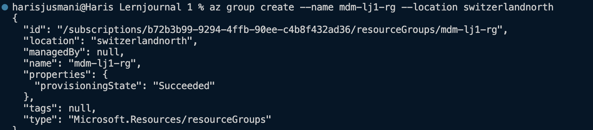
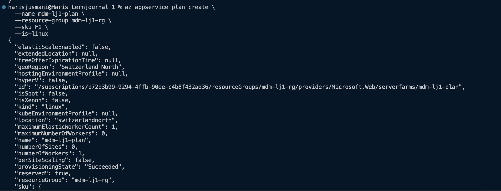
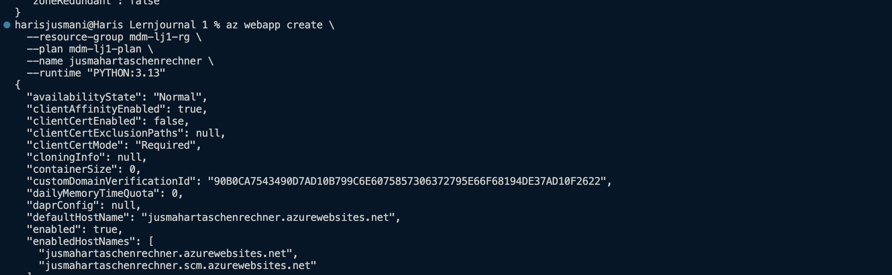
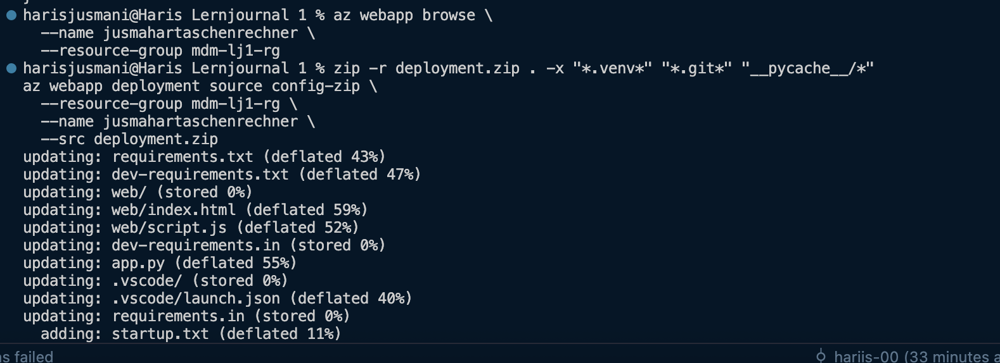
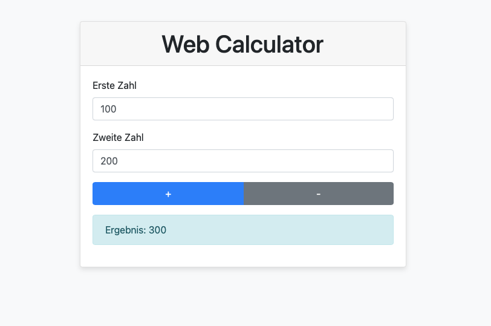

# Lernjournal 1 Python

## Repository und Library

| | Bitte ausfüllen |
| -------- | ------- |
| Repository (URL)  | https://github.com/hariis-00/SW2 |
| Kurze Beschreibung der App-Funktion | Es ist ein einfacher Taschenrechner, welcher die Addition und Subtraktion von 2 Zahlen durchführen kann.|
| Verwendete Library aus PyPi (Name) |blinker, click, flask, jinja2, markupsafe, werkzeug|
| Verwendete Library aus PyPi (URL) | https://pypi.org/project/blinker/1.9.0/ , https://pypi.org/project/click/8.1.8/ ,  https://pypi.org/project/Jinja2/3.1.5/ https://pypi.org/project/MarkupSafe/3.0.2 , https://pypi.org/project/Werkzeug/3.1.3/  |

## App, Funktionalität

Ziel war es, eine einfache Web-Applikation zu entwickeln, bei der zwei Zahlen eingegeben und anschließend addiert oder subtrahiert werden können. Die Umsetzung erfolgte mit **Flask (Backend)**, sowie **Bootstrap (Styling)**.

Die Benutzeroberfläche (`index.html`) enthält:
- Zwei Eingabefelder
- Zwei Buttons für `+` und `−`
- Eine Ergebnisanzeige im Bootstrap-Style

Die Logik zur Kommunikation mit dem Backend ist in `script.js` implementiert. Sobald ein Button geklickt wird, sendet die `fetch()`-Funktion einen JSON-Request an die `/calculate`-Route im Flask-Backend.

Das Backend (`app.py`) verarbeitet diesen Request:
- Die Werte `num1`, `num2` und `operation` werden aus dem Request extrahiert
- Je nach Operation (`add` oder `subtract`) wird das Resultat berechnet
- Die Antwort erfolgt als JSON-Response zurück ans Frontend

## Dependency Management

Für die Verwaltung der Python-Abhängigkeiten habe ich auf ein sauberes, reproduzierbares Setup gesetzt. Dabei kamm pip-tools zum Einsatz, welches es ermöglicht, aus einer deklarativen Datei (requirements.in) eine vollständig aufgelöste Datei (requirements.txt) mit allen direkten und transitiven Abhängigkeiten zu generieren.

Vorteile dieses Ansatzes:
- Reproduzierbarkeit: Das Projekt kann auf jedem Rechner mit den exakt gleichen Versionen installiert werden
- Transparenz: Welche Librarys von anderen Librarys abhängen, ist durch die .txt-Dateien gut nachvollziehbar

Setup-Befehl:
pip install -r requirements.txt

## Deployment

Für das Deployment der Webapplikation wurde Microsoft Azure verwendet. Ziel war es, das lokal entwickelte Flask-Projekt als ZIP-Datei auf einen Azure App Service zu deployen, sodass es öffentlich erreichbar ist – ohne Containerisierung oder Docker.

Vorgehen Schritt für Schritt:

1. Projekt vorbereiten (ZIP-Archiv erstellen)
Zuerst wurde das Projekt als ZIP-Datei verpackt, wobei temporäre Dateien (z.B. .venv) ausgeschlossen wurden:
`zip -r deployment.zip . -x "*.venv*" "*.git*" "__pycache__/*"`

2. Azure Ressource anlegen:
Es wurde eine neue Ressourcengruppe, ein App Service Plan und eine Web-App mit Python Runtime erstellt. Dabei wurde die Version Python 3.13 gewählt und ein frei wählbarer App-Name vergeben:

`az group create --name mdm-lj1-rg --location switzerlandnorth`

`az appservice plan create --name mdm-lj1-plan --resource-group mdm-lj1-rg --sku F1 --is-linux`

`az webapp create --resource-group mdm-lj1-rg --plan mdm-lj1-plan --name jusmahartaschenrechner --runtime "PYTHON:3.13"`

3. Startkonfiguration für Azure
Azure erwartet beim Python-Deployment einen sogenannten Entry-Point. Damit gunicorn die Flask-App starten kann, wurde eine startup.txt mit folgendem Inhalt im Projektverzeichnis erstellt:
`gunicorn --bind=0.0.0.0 --timeout 600 app:app`

4. Deployment durchführen
Die ZIP-Datei wurde via Azure CLI hochgeladen:

`az webapp deployment source config-zip --resource-group mdm-lj1-rg --name jusmahartaschenrechner --src deployment.zip`

5. Webapp aufrufen:
Nach dem erfolgreichen Upload war die Anwendung sofort unter folgender URL ersichtlich:
https://jusmahartaschenrechner.azurewebsites.net

Fazit:
Durch das Deployment mit Azure konnte ich die Webapplikation vollständig in Betrieb nehmen und öffentlich zugänglich machen. Die gewonnenen Erkenntnisse helfen mir zukünftig beim Verständnis von App Services. 
