# Lernjournal 2 Container

## Docker Web-Applikation

### Verwendete Docker Images

| | Bitte ausfüllen |
| -------- | ------- |
| Image 1 | Metabase |
| Image 1 | https://hub.docker.com/r/metabase/metabase |
| Image 2 | PostgreSQL |
| Image 2 | (https://hub.docker.com/_/postgres) |
| Docker Compose | https://hub.docker.com/r/hariis/onnx-image-classification |

### Dokumentation manuelles Deployment

Inital habe ich versucht die Anwendung (Metabase + PostgreSQL) manuell einzurichten via Netzwerke. Dabei wurden die beiden Container gezielt über ein gemeinsames Docker-Netzwerk verbunden. Ziel war es, das Zusammenspiel von Images, Container und Docker-Netzwerken besser zu verstehen und kontrolliert zu testen.

Schritte:
1. Zuerst wurde ein separates Netzwerk erstellt, damit sich die Container gegenseitig per Namen erreichen können.
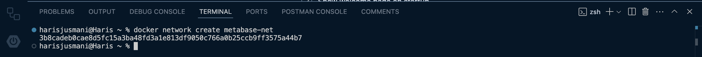
2. Der PostgreSQL-Container wurde im Hintergrund gestartet und direkt mit dem Netzwerk `metabase-net` verbunden. Die Datebank wird beim Start automatisch konfiguriert.
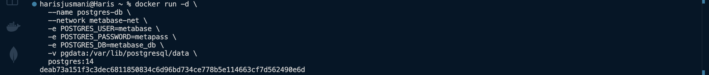
3. Im zweiten Schritt wurde der Metabase-Container gestartet - ebenfalls im gleichen Netzwerk. Über die Umgebungsvariablen wird die PostgreSQL-Datenbank als Backend angegeben.
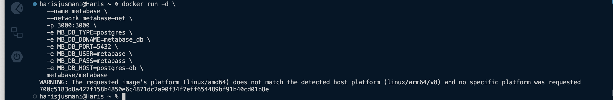
4. Nun sind im Docker die beiden Images ersichtlich und der Connection-String zum Localhost:3000 wird angegeben.
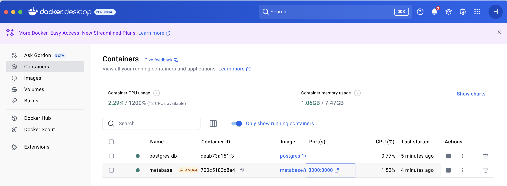

### Dokumentation Docker-Compose Deployment

Für die Docker-Compose Deployment habe ich ein Beispiel mit 2 Containern umgesetzt: Metabase (Analyse- und Visualisierungsplattform) und PostreSQL (Datenbank)

Vorgehen:
Die gesamte Konfiguration erfolgte über eine docker-compose.yml Datei, die beide Container definiert. PostgreSQL wurde so konfiguriert, dass eine Datenbank namens metabase_db beim Start automatisch angelegt wird. Metabase wurde so konfiguriert, dass es diese Datenbank als interne Konfigurationsdatenbank für Metabase fungiert.

Schritte:
1. Ich habe folglich ein Ordner im Visual Studio Code eröffnet, in dem ich meine docker-compose.yml angesetzt habe. Ich habe dort festgelegt, wie die beiden Images ausgeführt werden sollten, wenn ich Compose Up ausführe.
2. Das System habe ich anschliessend mit dem Befehl `docker-compose up -d` gestartet. Alternativ kann das System via Rechtsklick auf dem Docker-compose File gestartet werden.
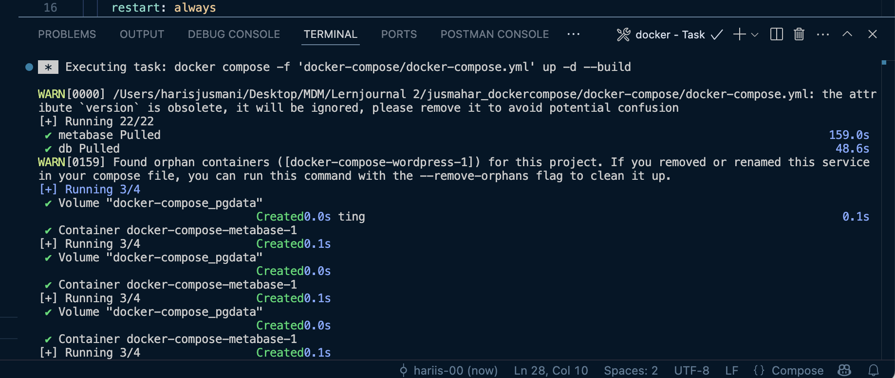
3. Nach wenigen Sekunden war die Metabase-Obefläche unter `localhost:3000` erreichbar. Beim ersten Start durchlief ich den Initialisierungsprozess im Browser (Benutzername, Passwort, Verbindung zur DB). Anschliessend war die Anwendung einsatzbereit.
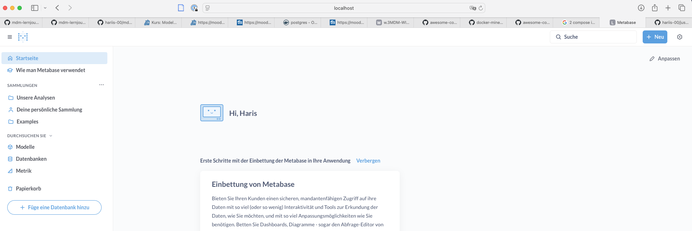

Erkenntnisse aus der Vorgehensweise:
1. Durch das `docker-compose.yml` lassen sich beide Container nahtlos betreiben.
2. Die Anwendung lässt sich in 2-3 Minuten aufsetzen, sieht aber wie eine professionelle BI-Anwendung aus, die auch für echte Use-Cases verwendet werden kann.

Ansicht Docker:

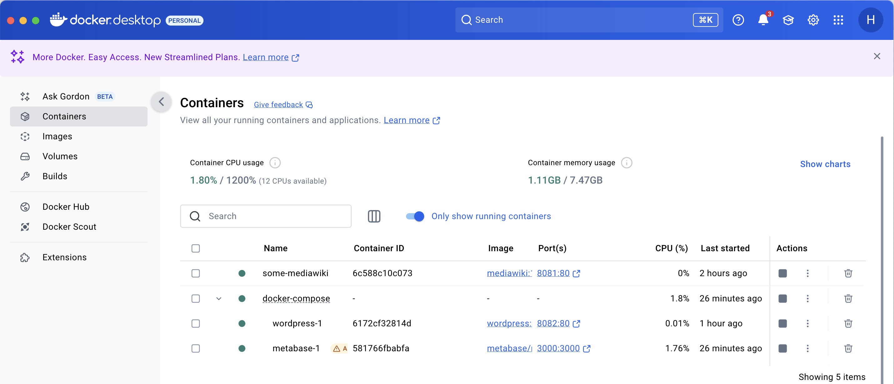

## Deployment ML-App

### Variante und Repository

| Gewähltes Beispiel | Bitte ausfüllen |
| -------- | ------- |
| onnx-sentiment-analysis | Nein |
| onnx-image-classification | Ja |
| Repo URL Fork | https://github.com/mosazhaw/onnx-image-classification.git |
| Docker Hub URL | https://hub.docker.com/r/hariis/onnx-image-classification |

### Dokumentation lokales Deployment

Im zweiten Teil des Lernjournals habe ich das Beispiel onnx-image-classification auf Github geforkt und lokal geklont. Das Projekt enthält bereits ein funktionierendes Dockerfile, welches die benötigten Dateien (ONNX-Modell, labels_map.txt, app.py, Web-UI etc.) sowie die benötigten Python Librarys (requirements.txt) definiert.

Schritte:
1. Fork auf Github von onnx-image-classfication
2. Projekt in VS-Code geöffnet und ins Dockerfile gewechselt
3. Terminal geöffnet und mittels Dockerfile ein Image in mein Docker Hub (hariis) erstellt mittels: `docker build -t hariis/onnx-image-classification:latest .`
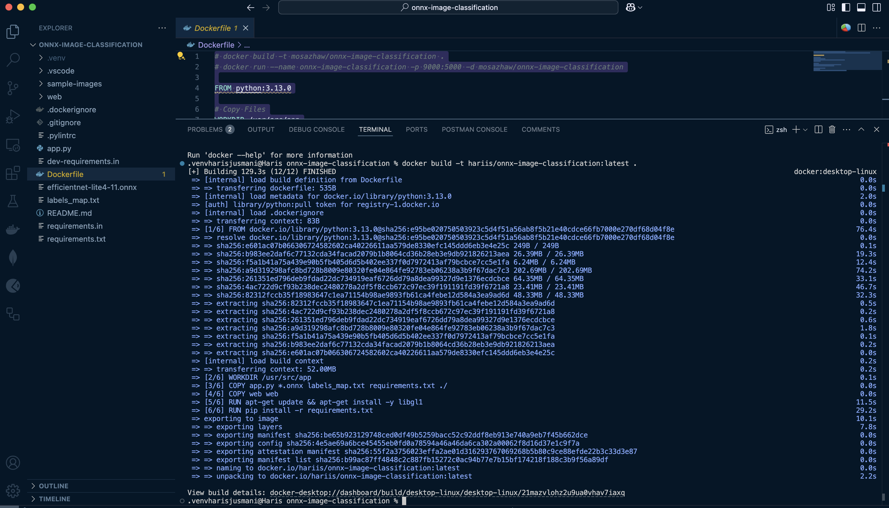
4. Ich konnte das Image nun in meinem Docker Hub ansehen:
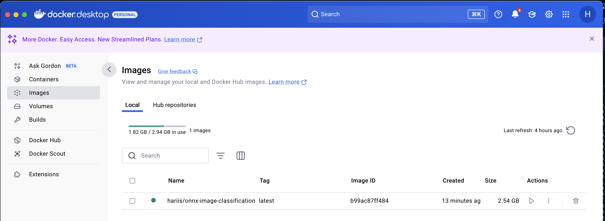
5. Anschliessend habe ich den Container lokal gestartet. Port 5000 im Container wurde auf Port 9000 von meinem Rechner gemappt:
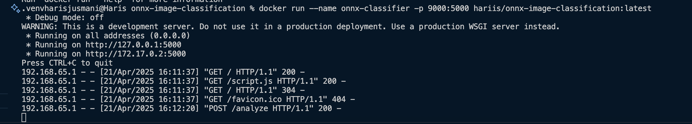
6. Die Anwendung war im Anschluss direkt über den Browser unter localhost:9000 erreichbar. Die Benutzeroberfläche wurde korrekt geladen und ich konnte mittels einem Bild eines Elefanten auch das Testing der Webapplikation durchführen.
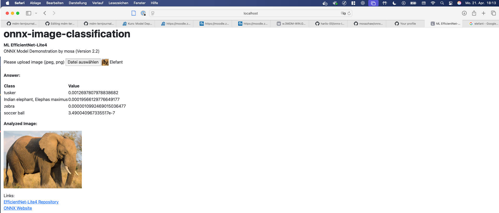
7. Nach einem erfolgreichen Testlauf habe ich das lokale Image auf Docker Hub veröffentlicht:
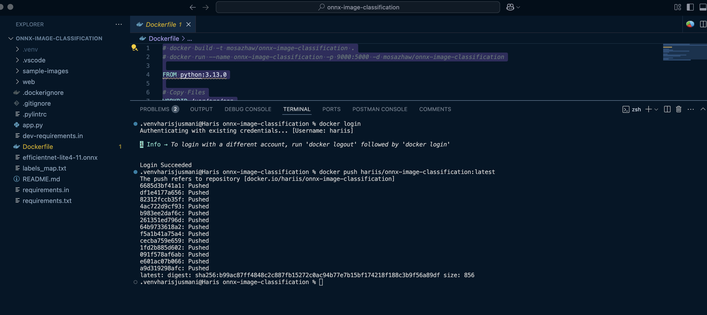
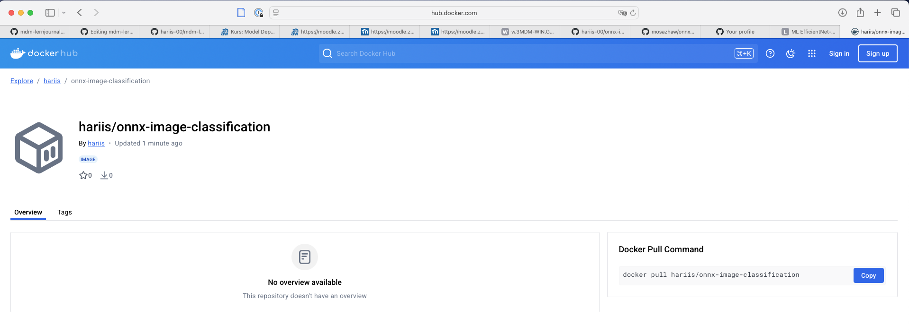

### Dokumentation Deployment Azure Web App

Im Anschluss an den lokalen Build und Push meines ONNX Image Classfication Containeres auf Docker Hub habe ich das Image in einer Azure Web App deployed.

Vorgehen:
1. Ressourcengruppe erstellt via `az group create --name mdm-lj2-rg --location switzerlandnorth`
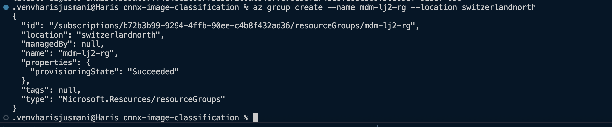
2. Erstellung des App Service Plan (F1):

3. Web App mit Docker Image deployen
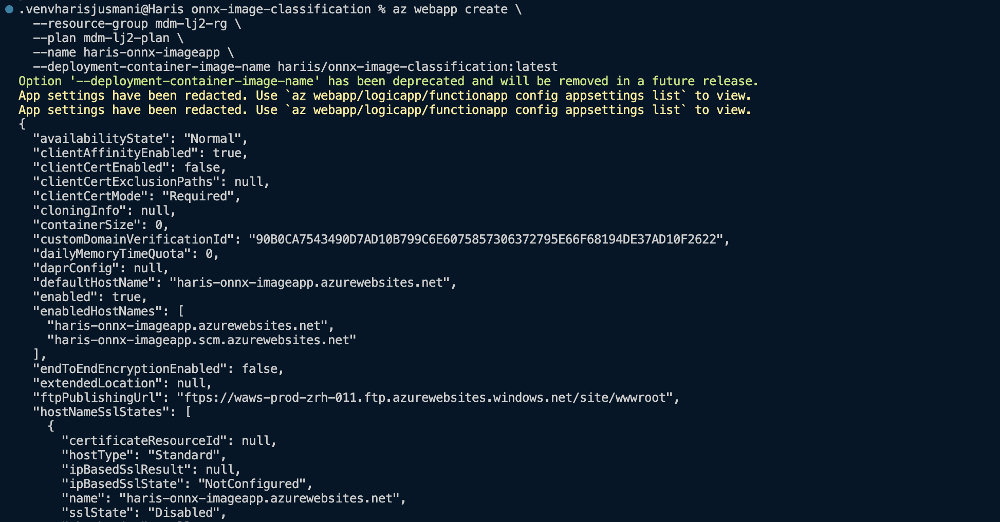
4. Das Deployment wurde erfolgreich durchgeführt und ist theoretisch via https://haris-onnx-imageapp.azurewebsites.net abrufbar. Dadurch, dass das Kontigent des F1-Plans bereits aufgebraucht war (Projekt 1 inkl. Lernjournal 1) ist das Abbild des Frontends nicht möglich

Besonderheiten:
1. Da ich mein Image auf einem ARM-basierten Mac (M4) gebaut hatte, musste ich es mit dem Zusatz `--platform linux/amd64` via `docker buildx` neu erstellen, da Azure Web Apps nur amd64 unterstützt.
2. Im Azure-Portal wurde beim Status "Kontingent überschritten" angezeigt. Das liegt daran, dass der F1-Plan nur 1 GB & 1 Web App gleichzeitig erlaubt. Auch nachdem ich die anderen WebApps beendet habe und erneutem Deployment veränderte sich der Status nicht. Gem. Logs ist jedoch das Deployment korrekt verlaufen.

### Dokumentation Deployment ACA

* [ ] TODO

### Dokumentation Deployment ACI

* [ ] TODO
