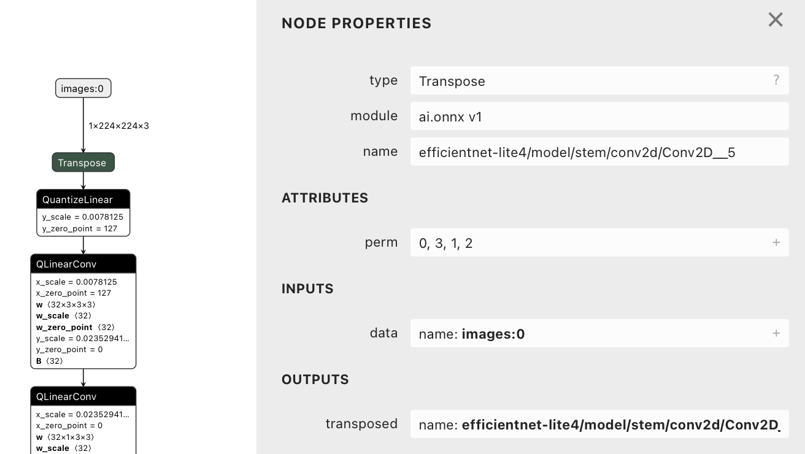
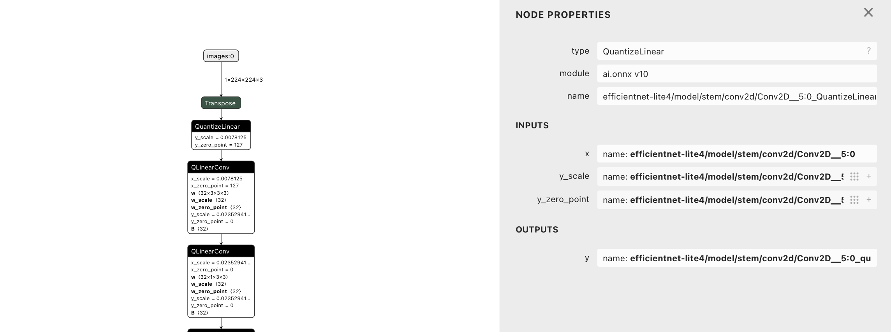
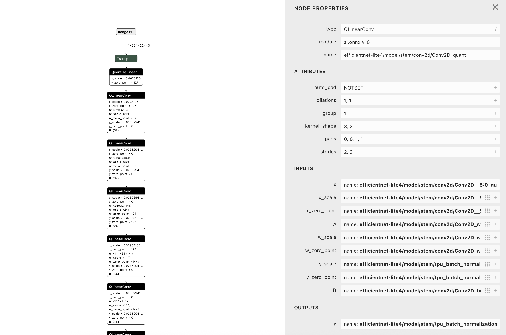

# Lernjournal 3 ONNX

## Übersicht

| | Bitte ausfüllen |
| -------- | ------- |
| ONNX Modell für Analyse (Netron) | https://github.com/onnx/models/blob/main/validated/vision/classification/efficientnet-lite4/model/efficientnet-lite4-11-int8.onnx |
| onnx-image-classification Fork (EfficientNet-Lite) | https://github.com/hariis-00/onnx-image-classification/blob/main/efficientnet-lite4-11.onnx |

## Dokumentation ONNX Analyse

In diesem Teil des Lernjournals beschäftigte ich mich mit dem Austausch und der Analyse von ONNX-Modellen inenrhalb einer bestehenden Anwendnung. Ziel war es, ein neues, quantisiertes Modell auszuwählen und dessen Architektur zu untersuchen, um ein besseres Verständnis für die Modellstrutkur zu gewinnen.

Gewähltes Modell:
Ich habe das Modell "efficientnet-lite4-int8.onnx" gewählt, welches im offiziellen ONNX Model Zoo zur Verfügung steht. Es handelt sich dabei um eine quantisierte Version des ursprünglich in der App verwendeten Modells "efficient-lite4-11.onxx". 

Download Link
--> (https://github.com/onnx/models/blob/main/validated/vision/classification/efficientnet-lite4/model/efficientnet-lite4-11-int8.onnx)

Der Hauptunterschied zur Originalversion besteht darin, dass das Modell vollständig quantisiert wurde (int8), was zu einer signifikanten Reduktion von Speicherbedarf und Latenz führ - bei potenziell leichtem Genauigkeits verlust

Layer 1:
Zur Analyse des Modells habe ich das Tool Netron.app verwendet. Die grafische Darstellung zeigt die ersten Schritte des Netzwerks beginnen mit dem Input-Tensor images:0 mit Shape 1x224x224x3 welcher nach einer Transpose-Operation in das Netzwerk eingespeist wird.

Layer 2:
Dieser Layer nimmt das quantisierte Eingangsbild entgegen und führt eine klassische Faltung durch, jedoch diesmal vollständig im INT8-Raum
Ziel dieses Layers ist die Extraktion erster Feature Map, also einfach Textur-, Kanten- oder Farbkontraste werden herausgefiltert.

Layer 3:
Der nächste QLinearConv-Layer baut auf dem Ergebnis des vorherigen auf und verwendet einen neuen Satz quantisierter Filter mit anderen Skalenwerten. Beim dritten layer ist das Ziel die Erkennung mittelhohe Feature-Kombinationen wie z.B. Konturen, Übergänge oder symmetrische Strukturen. Dies ist ein Zwischenschritt bevor es in die Richtung semantischer Bildinhalte geht.

Gesamtanalyse: was macht EfficientNet-Lite4 eigentlich?
EfficientNet-Lite4 ist auf Effizienz optimiertes Convolutional Neural Network (CNN) für Bildklassifikation. Es basiert auf dem ursprünglichen EfficientNet von Google.

## Dokumentation onnx-image-classification

* [ ] TODO
