# Projekt 1 Python

## Übersicht

| | Bitte ausfüllen |
| -------- | ------- |
| Variante | Eigenes Projekt (Booking.com) |
| Datenherkunft | Format (HTML, XML, JSON, ...), Beschreibung |
| Datenherkunft | Booking.com |
| ML-Algorithmus | Polynominale Regression |
| Repo URL | URL |

## Dokumentation

### Data Scraping

Der erste Schritt des Projekts bestand darin, Hoteldaten von Booking.com zu scrapen.

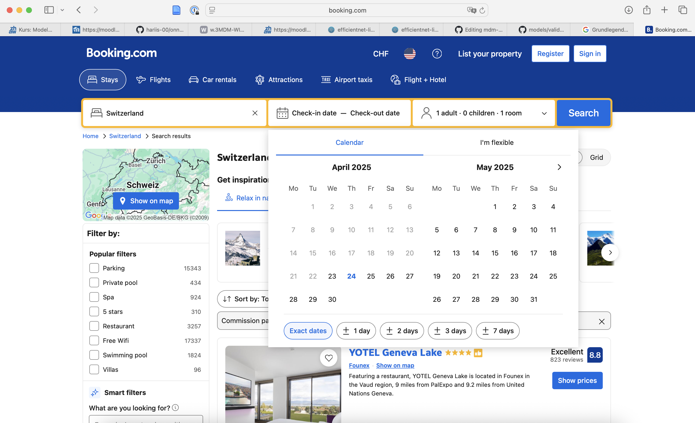

Dazu wurde die Python Library **Playwright** verwendet, da sie im Vergleich zu Selenium moderner, schneller und robuster gegenüber dynamischen Webseiteninhalten ist. Des Weitern konnte das Scraping mit scrapy nicht durchgeführt werden, da die Spiders meist fehlerhaft waren. 

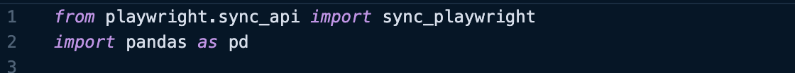

Im Script **bookingscraper.py** wurde eine For-Schleife über 10 Ergebnisseiten aufgebaut. Bei rund 25 Hotelanzeigen macht das 250 Hotelangebote. Für jedes Hotel wurden die wichtigsten Mermale extrahiert:
- Hotelname
- Preis
- Bewertungsscore
- Anzahl Reviews
- Ort/Adresse

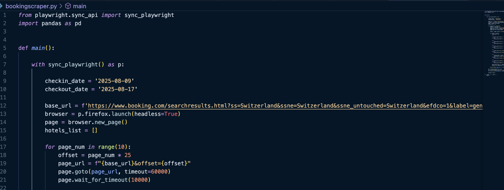
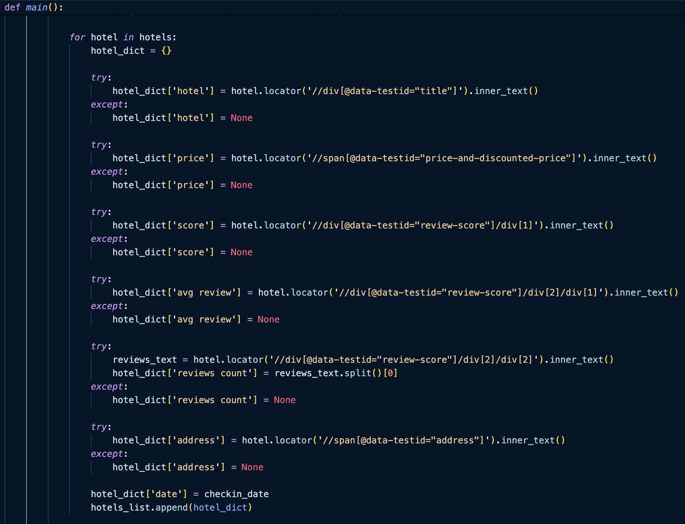

Das Scraping dauerte einige wenige Minuten, sodass ich mich für eine eher kleinere Anzahl entschieden habe, sodass wir noch genug Daten für eine ML-Anwendung haben.

Ich habe auch bereits im Script festgelegt, welche Daten dabei berücksichtigt werden, nämlich der Zeitraum von 09.08.2025 bis 17.08.2025, also typische Sommerferien im Kanton Zürich. 

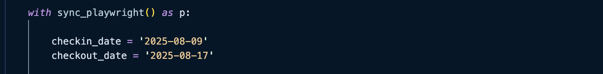

Die Daten wurden anschliessend in ein Excel- und CSV-Format exportiert, sodass sie später in eine Datenbank (in meinem Fall MongoDB) abgespeichert werden konnten. 
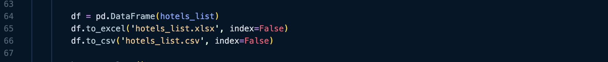
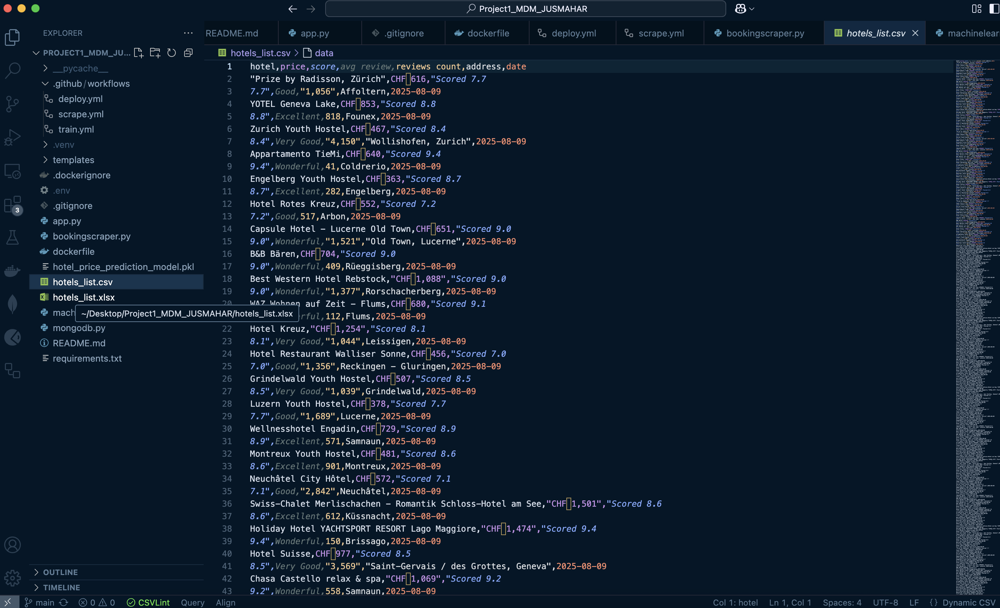

Damit die Daten auch von der CSV-Datei korrekt in die MongoDB geladen werden, habe ich ein Python-Script erstellt. Via MONGO_URI kann ich auf meine "Booking" Datenbank zugreifen und die Daten in meine "Hotel" Collection einfügen. 
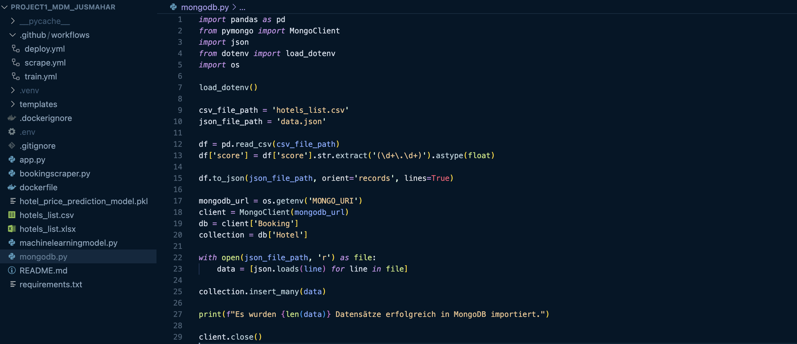

Nach wenigen Sekunden waren die Daten in der MongoDB abgelegt:
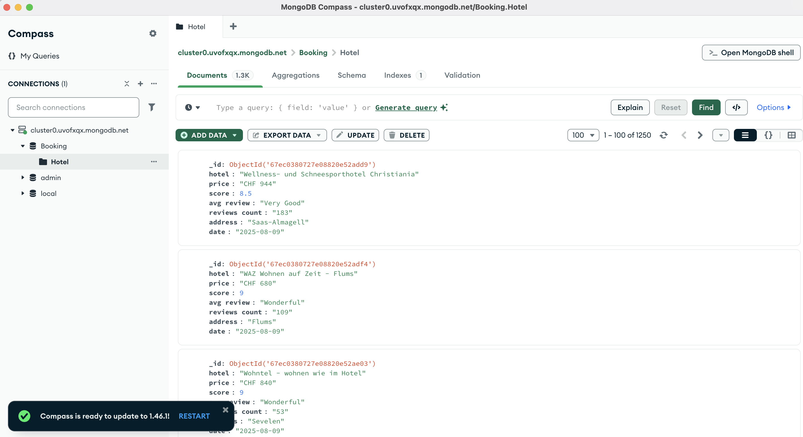

### Training

Das Machine Learning Modell wird im Script `machinelearningmodel.py` trainiert. Es basiert auf den aus MongoDB geladenen Daten. 

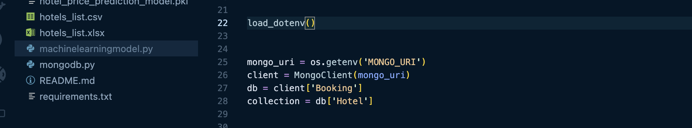

Die wesentlichen Schritte:

1. **Datenbereinigung**:
   - Preise wurden von „CHF“-Symbolen befreit
   - Reviews als Integer gespeichert
   - Score als Float interpretiert

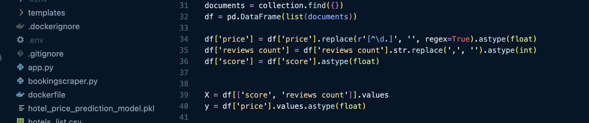

Die Daten wurden aus der Datenbank extrahiert un in ein Pandas-Dataframe eingefügt. Die Spalten `price` und `reviews count` wurden mittels Regex bereinigt, sodass ich nur numerische Werte habe. Der Wert `score` wurde ebenfalls konvertiert, sodass es ein Float-Wert gibt. 

2. **Feature Engineering**:
   - Eingesetzte Features: `score` & `reviews count`
   - Zielwert: `price`

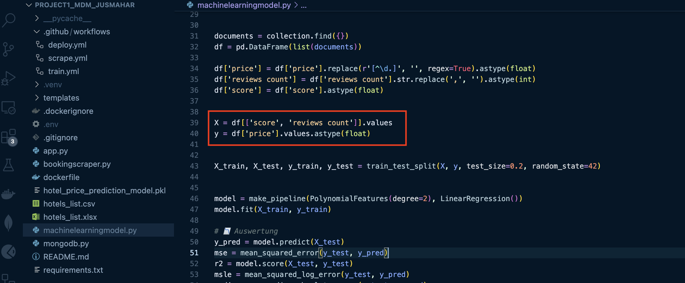

Die Features `score` und `reviews count` und der Target `price` wurden für die Anwendung von Machine Learning festgelegt. Des Weiteren wurden die Daten in Trainings- und Testdaten aufgeteilt, um das Modell zu trainieren und die Leistung messen zu können.

3. **Modellwahl**:
   - Ein **Polynomial Regressionsmodell (Grad 2)** wurde über `sklearn.pipeline` implementiert.
   - Die Wahl fiel darauf, da lineare Zusammenhänge nicht ausreichten, um nicht-lineare Muster (z. B. starke Preise bei hohen Scores) zu erfassen.
  
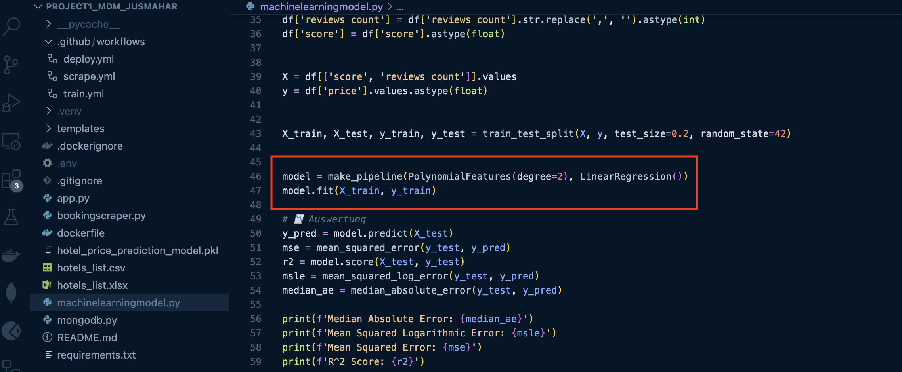

Die Pipeline `PolynomialFeatures` und `LinearRegression` wurde erstellt, um die nichtlinearen Beziehungen zwischen den Features und dem Target zu berücksichtigen. Als Polynomialgrad wurde Grad 2 genommen, damit wir die Werte quadrieren.

4. **Evaluierung**:
   - Verwendete Metriken: R²-Score, MSE, MSLE, Median Absolute Error
   - Die Metriken wurden ausgegeben und dienten zur Beurteilung der Modellgüte.
  
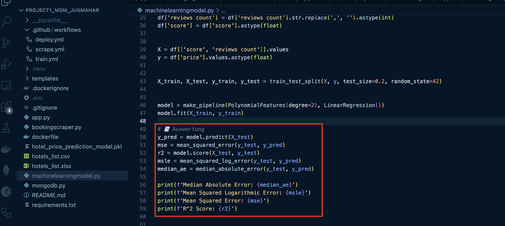

Das Modell wurde mit den Trainingsdaten trainiert und mit den Testdaten evaluiert, um die verschiedenen Metriken wie MSE, R²-Score, MSLE und den median_ae zu berechnen. 

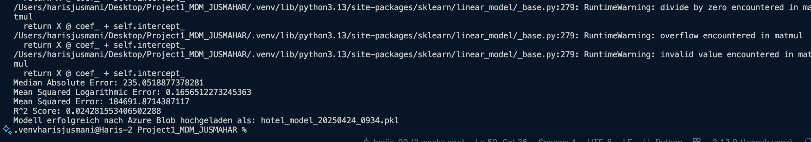

Somit konnte eine Korrelationsmatrix erstellt werden, welche die Beziehungen zwischen den numerischen Variablen visualisiert. Sämtliche nicht numerischen Variablen werden dabei extrahiert und entfernt. 

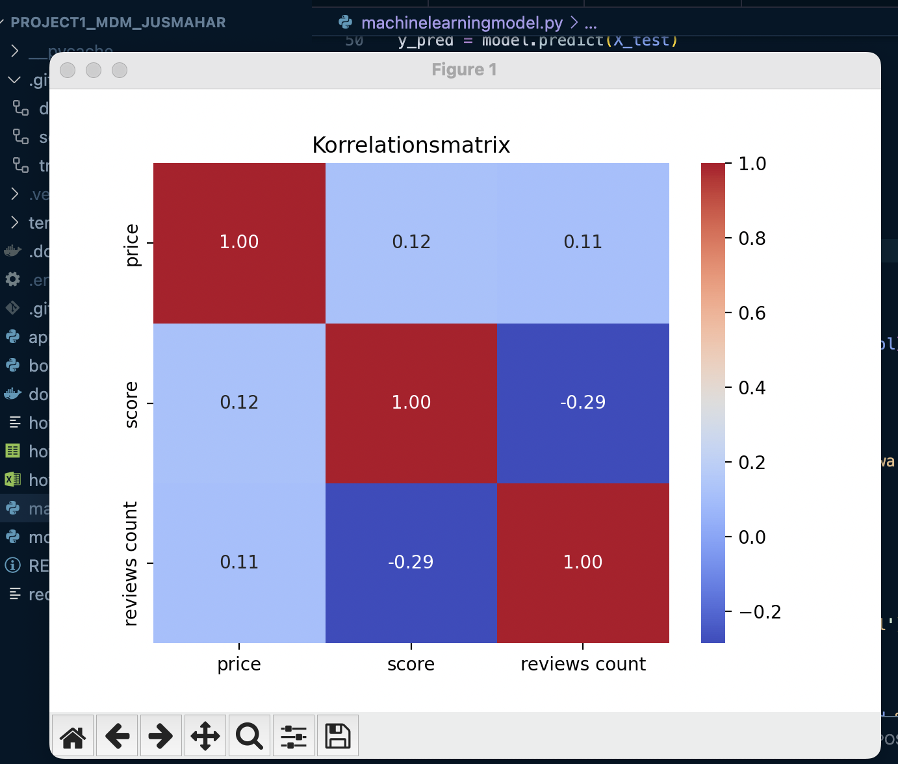

5. **Speicherung**:
   - Das Modell wurde mit `joblib` als `.pkl` gespeichert und optional im Azure Blob Storage versioniert hochgeladen.
  
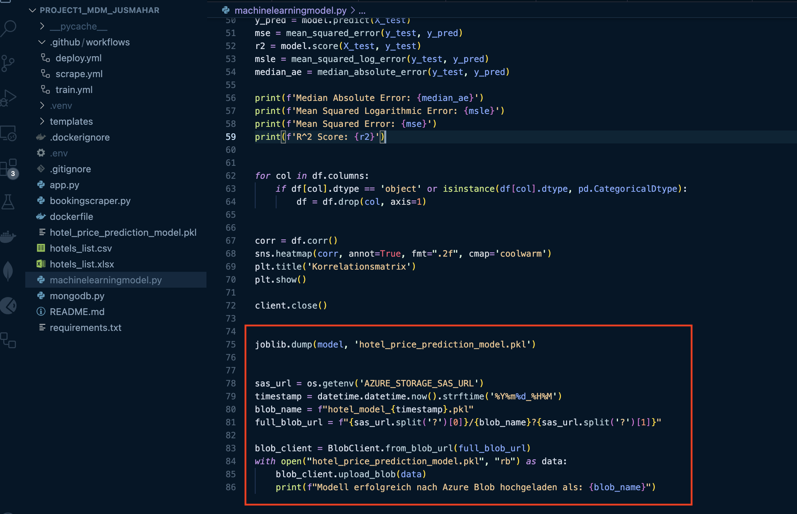

Damit wir eine korrekte Versionierung des Modells haben, wurden die jeweils erstellten Modelle in den Azure Blob Storage abgespeichert. Somit kann sichergestellt werden, dass wir zu jedem Zeitpunkt wissen, welches Modell für die Bearbeitung der Daten verwendet wurde.

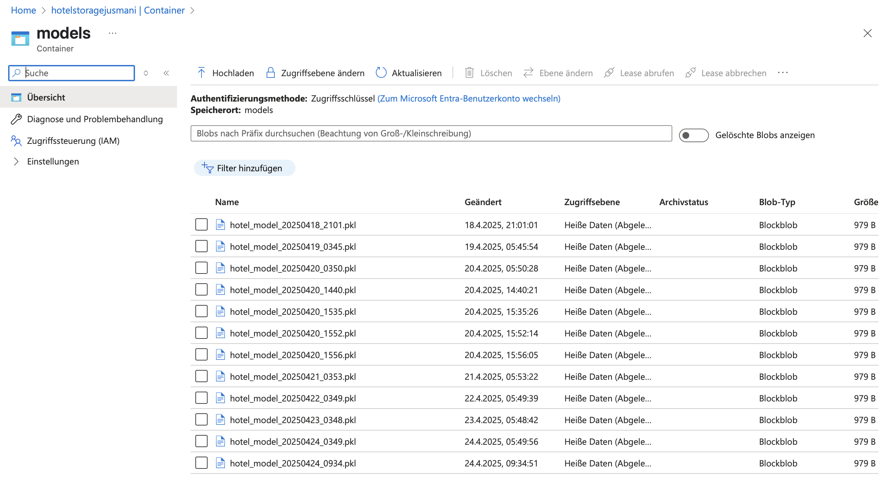

### ModelOps Automation

Für das ModelOps-Setup wurden mehrere GitHub Actions Workflows eingerichtet:

1. **Scraping Workflow - scrape.yml**:
Scrape.yml führt täglich um 05:00 Uhr (03:00 UTC) das Webscraping auf Booking.com durch und speichert diese, wie bis anhin, einmal als .csv und einmal als .xlsx. Diese Daten werden dann ebenfalls an die MongoDB weitergeleitet zur Speicherung.

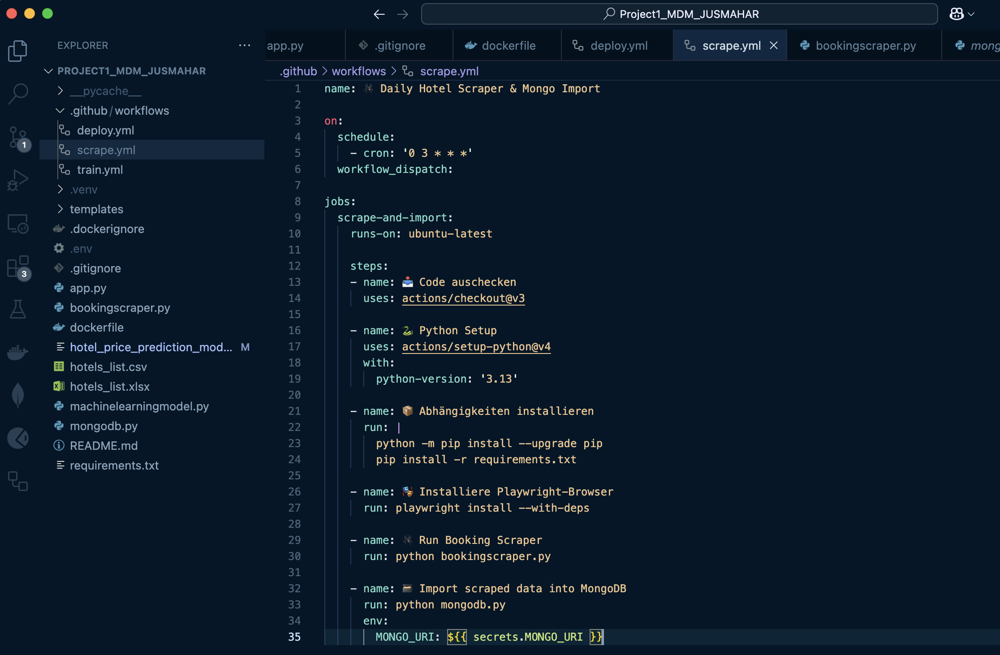

Bei jeder Ausführung ist entsprechend in GitHub Actions der Workflow zu sehen ob dieser erfolgreich gestartet wurde:

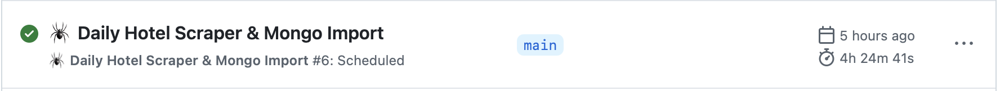

2. **Training Workflow - train.yml**:
Train.yml führt täglich um 05:30 Uhr (03:00 UTC, Zeitversetzt zum Scraping Workflow) das Modelltraining auf Basis der neu gescrapten Daten durch und speichert das .pkl-File auch automatisch in den Azure Blob Storage. Dabei kann der Workflow via SAS_URL zugreifen, die ich in den Secrets des Repo's hinterlegt habe:

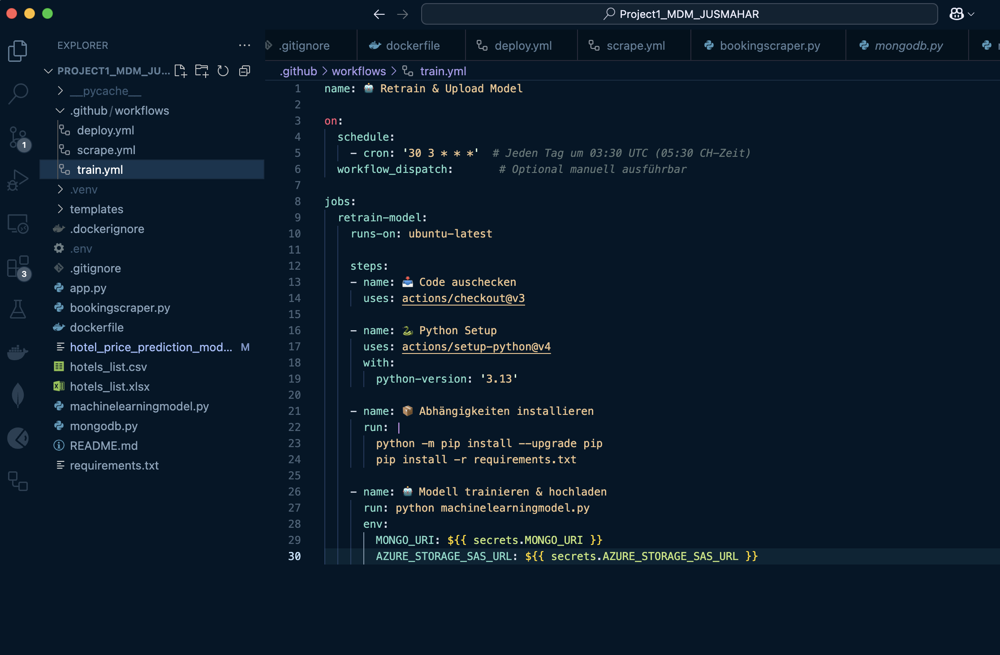

Bei jeder Ausführung ist entsprechend in GitHub Actions der Workflow zu sehen ob dieser erfolgreich gestartet wurde:
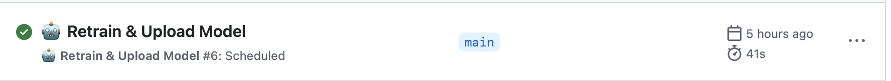

3. **Deployment Workflow - deploy.yml**:
Deployment.yml baut automatisch das Docker-Image und deployed es auf den Azure Web App Service. Damit dies überhaupt geschehen kann, muss ein .pkl-File vorhanden sein. Das Frontend und die Flask-App werden in einem Container bereitgestellt. Der Workflow wird beim Push auf main automatisch ausgelöst.

Bei jeder Ausführung ist entsprechend in GitHub Actions der Workflow zu sehen ob dieser erfolgreich gestartet wurde:
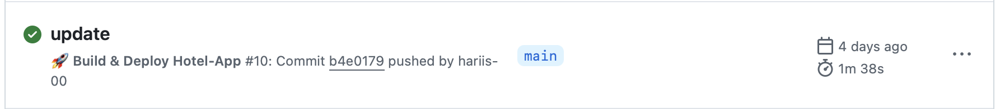

### Deployment

Da Ziel des Deployments war, die gesamte Machine Learning Anwendung, inklusive Web-App, UI und ML-Modell in einem Docker-Container bereitzustellen und auf Azure App Service zu deployen.

Damit das Deployment erfolgreich funktioniert, habe ich folgende Schritte unternommen:
1. Zuerst habe ich überprüft, ob sämtliche Komponenten (Backend, Frontend, Scraping etc.) lokal funktionieren und habe es via `flask run` zum laufen gebracht.

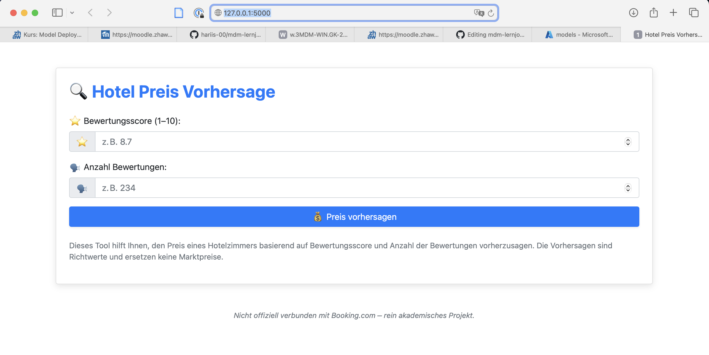

2. Sobald alles funktioniert hat, habe ich dann ein Docker-Image mit dockerfile erstellt, welches das Image kreieren sollte:

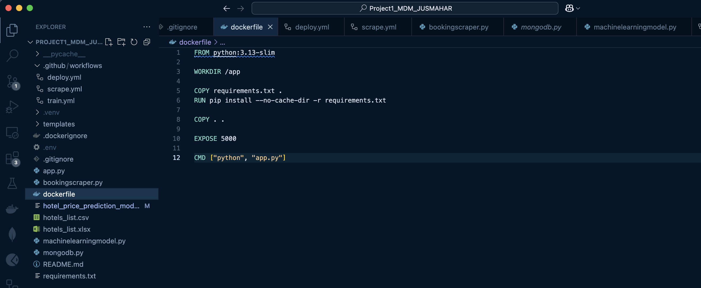

Somit konnte das Docker-Image via `docker build -t hariis/hotel-app` erstellen:

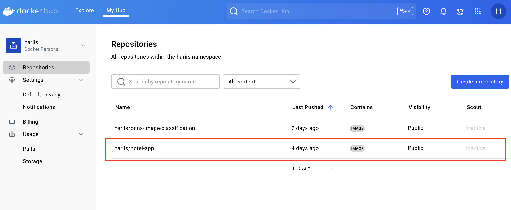

und via `docker run -p 5000:5000 hotel-app` auch ebenfalls ausführen.

3. Nach dem ich das Image erstellt habe, musste ich das Image noch auf DockerHub pushen, sodass es öffentlich zugänglich ist. Dies habe ich via:
`docker tag hotel-app hariis/hotel-app:latest`
`docker pusht hariis/hotel-app:latest`
machen können.
Damit das ganze auch funktioniert, musste ich vorgängig die Zugangsdaten von DockerHub in den Secrets hinterlegen, sodass dies überprüft werden kann.

4. Im Anschluss habe ich dann diverse Ressourcen via Azure CLI eröffnet, nämlich:
- Ressourcengruppe: project1
- App Service Plan
- Web App: hotel-preis-app-jusmani

Die 

