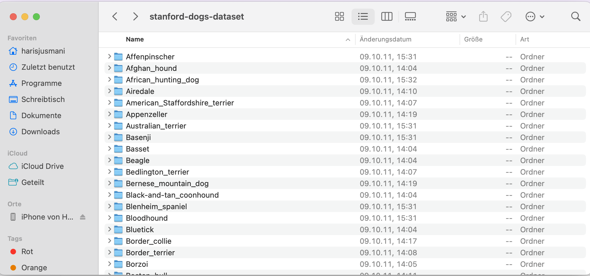
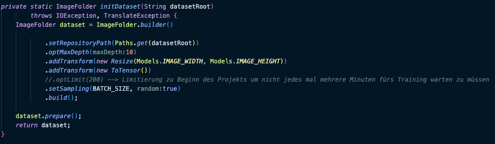
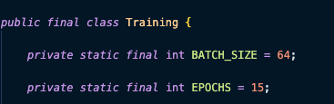
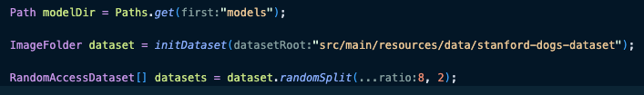
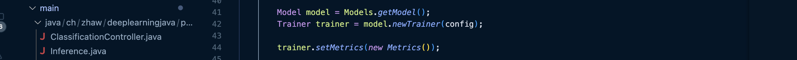
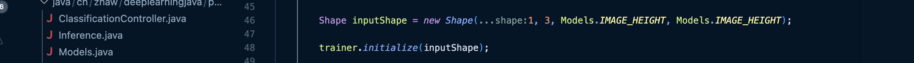
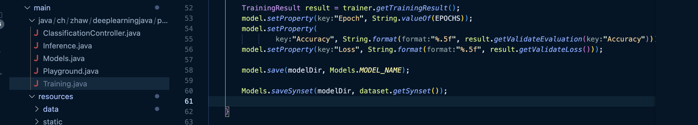
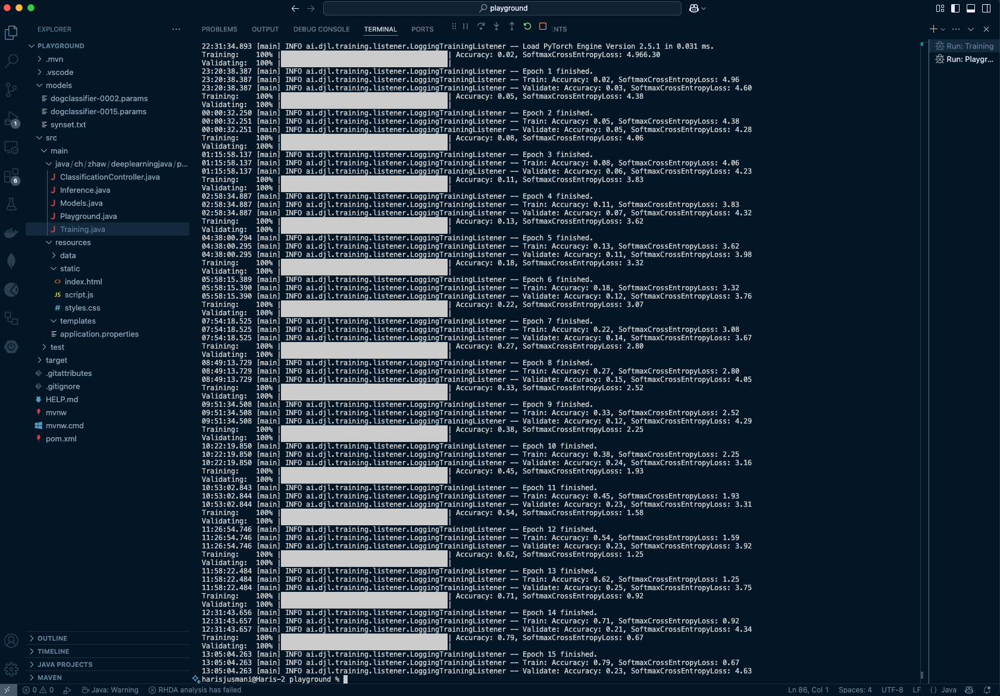

# Projekt 2 Java

## Übersicht

| | Bitte ausfüllen |
| -------- | ------- |
| Variante | Vorlesungsbeispiel/Vorhandenes Modell/Vorhandener Datensatz  |
| Datensatz (wenn selbstgewählt) | JPEG-Bilder von Hunden/Hunderassen |
| Datensatz (wenn selbstgewählt) | http://vision.stanford.edu/aditya86/ImageNetDogs/ |
| Modell (wenn selbstgewählt) | https://pytorch.org/vision/main/models/generated/torchvision.models.resnet50.html |
| ML-Algorithmus | Bezeichnung |
| Repo URL | [(https://github.com/hariis-00/Project2_MDM_JUSMAHAR) |

## Dokumentation

### Daten

Da im zweiten Projekt kein Scrapping verlangt wurde, habe ich mich auf die Suche gemacht, um ein passendes Datenset mit guten Bildern zu finden. Ich habe im zweiten Projekt eine Image Classification erstellt, die das Ziel hat, eine bestimmte Hunderasse zu identifizieren, sobald das Bild hochgeladen wurde. Das Datenset stammt von der Universität Stanford und wurde von 4 Studenten vorbereitet. Es beeinhaltet totel 120 Hunderassen mit ca. 150 Bildern pro Rasse. Dies entspricht einem Total von 20'580 Bildern, welcher wir für das Training berücksichtigen. 

Bevor ich die Daten weiterverarbeitet habe, wurden diese durch mich bereinigt, sodass jeweils im Ordnernamen die eindeutige Rasse beschrieben ist:

Ich hatte das Glück, dass ich mir erst vor kurzem einen sehr leistungsstarken Laptop geholt habe und die grosse Anzahl an Bildern relativ zügig trainiert werden konnte. Somit habe ich darauf verzichtet die Menge der Bilder einzuschränken. Lediglich beim Training habe ich zu Beginn die Grösse eingeschränkt, damit ich nicht jedes Mal lange warten muss. Meistens habe ich mit 200 Bildern gearbeitet, dies innert 4-5 Sekunden trainiert werden konnten.

### Training

Ich habe im File "Training.java" entsprechend definiert wie die Bilder trainiert werden sollten. Zu Beginn habe ich mal definiert wie gross die Batch-Size und die Anzahl Epochen. Batch-Size zeigt, wie viele Bilder gleichzeitig trainiert werden sollten und die Epochen, wie viele Durchgänge gemacht werden sollten. Ich habe mich dort herangetastet und versucht das bestmögliche Resultat zu erhalten. 

Am Schluss habe ich mich entschieden, dass eine Batch-Size von 64 und 15 Epochen ein ideales Training für die Bilderkennung sind. 

Das Training wird angestossen mit der Methode "main" die folgenden Ablauf innehat:
1. Der Bildordner "Stanford-dogs-dataset" sollte aufgerufen werden und die Bilder bereits so aufteilen, dass ein Verhältnis von 80/20 zwischen Trainings- und Validierungsdaten entsteht.

2. Es wird ein Konfigurationsobjekt erstellt, das Informationen wie die Genauigkeit (Accuracy), Verlust (Loss) & Listener für das Training beinhaltet.

3. Modell und Trainer konfigurieren bzw. initialisieren:

4. Eingabeformat der Bilder definieren, sodass in der Netzwerkarchitektur korrekt initialisiert werden:

5. Trainingsergebnisse (Accuracy und Loss) & Modell abspeichern:

Bei mir sah das Training folgendermassen (Batch-Size 64 und 15 Epochen, auf rund 20'000 Bilder, Zeitdauer ca. 3 Stunden) aus:

Man sieht dass zu Beginn die Trainingsgenauigkeit sehr niedrig (z.B. Epoche 1: Train Accuracy = 0.02, Validate = 0.02) war. Die Genauigkeit konnte über die Anzahl der Epochen immer wieder gesteigert werden.

### Inference / Serving

* [ ] TODO

### Deployment

* [ ] TODO
