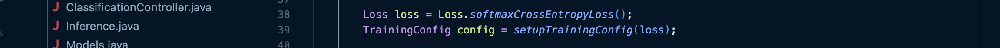

# Projekt 2 Java

## Übersicht

| | Bitte ausfüllen |
| -------- | ------- |
| Variante | Vorlesungsbeispiel/Vorhandenes Modell/Vorhandener Datensatz  |
| Datensatz (wenn selbstgewählt) | JPEG-Bilder von Hunden/Hunderassen |
| Datensatz (wenn selbstgewählt) | http://vision.stanford.edu/aditya86/ImageNetDogs/ |
| Modell (wenn selbstgewählt) | https://pytorch.org/vision/main/models/generated/torchvision.models.resnet50.html |
| ML-Algorithmus | Bezeichnung |
| Repo URL | [(https://github.com/hariis-00/Project2_MDM_JUSMAHAR) |

## Dokumentation

### Daten

Da im zweiten Projekt kein Scrapping verlangt wurde, habe ich mich auf die Suche gemacht, um ein passendes Datenset mit guten Bildern zu finden. Ich habe im zweiten Projekt eine Image Classification erstellt, die das Ziel hat, eine bestimmte Hunderasse zu identifizieren, sobald das Bild hochgeladen wurde. Das Datenset stammt von der Universität Stanford und wurde von 4 Studenten vorbereitet. Es beeinhaltet totel 120 Hunderassen mit ca. 150 Bildern pro Rasse. Dies entspricht einem Total von 20'580 Bildern, welcher wir für das Training berücksichtigen. 

Bevor ich die Daten weiterverarbeitet habe, wurden diese durch mich bereinigt, sodass jeweils im Ordnernamen die eindeutige Rasse beschrieben ist:


Ich hatte das Glück, dass ich mir erst vor kurzem einen sehr leistungsstarken Laptop geholt habe und die grosse Anzahl an Bildern relativ zügig trainiert werden konnte. Somit habe ich darauf verzichtet die Menge der Bilder einzuschränken. Lediglich beim Training habe ich zu Beginn die Grösse eingeschränkt, damit ich nicht jedes Mal lange warten muss. Meistens habe ich mit 200 Bildern gearbeitet, dies innert 4-5 Sekunden trainiert werden konnten.


### Training

Ich habe im File "Training.java" entsprechend definiert wie die Bilder trainiert werden sollten. Zu Beginn habe ich mal definiert wie gross die Batch-Size und die Anzahl Epochen. Batch-Size zeigt, wie viele Bilder gleichzeitig trainiert werden sollten und die Epochen, wie viele Durchgänge gemacht werden sollten. Ich habe mich dort herangetastet und versucht das bestmögliche Resultat zu erhalten. 

Am Schluss habe ich mich entschieden, dass eine Batch-Size von 64 und 15 Epochen ein ideales Training für die Bilderkennung sind. 


Das Training wird angestossen mit der Methode "main" die folgenden Ablauf innehat:
1. Der Bildordner "Stanford-dogs-dataset" sollte aufgerufen werden und die Bilder bereits so aufteilen, dass ein Verhältnis von 80/20 zwischen Trainings- und Validierungsdaten entsteht.

2. Es wird ein Konfigurationsobjekt erstellt, das Informationen wie die Genauigkeit (Accuracy), Verlust (Loss) & Listener für das Training beinhaltet.

3. Modell und Trainer konfigurieren bzw. initialisieren:

4. Eingabeformat der Bilder definieren, sodass in der Netzwerkarchitektur korrekt initialisiert werden:

5. Trainingsergebnisse (Accuracy und Loss) & Modell abspeichern:


Bei mir sah das Training folgendermassen (Batch-Size 64 und 15 Epochen, auf rund 20'000 Bilder, Zeitdauer ca. 3 Stunden) aus:


Man sieht dass zu Beginn die Trainingsgenauigkeit sehr niedrig (z.B. Epoche 1: Train Accuracy = 0.02, Validate = 0.02) war. Die Genauigkeit konnte über die Anzahl der Epochen immer wieder gesteigert werden. Ebenfalls war erkennbar, dass das Validierungsdatenset nach wie vor eine tiefe Accuracy hatte. Dies zeigt, dass das Modell stark overfitted, sprich eine sehr hohe Genauigkeit beim Training, aber schlechte Generalisierung auf den Validierungsdatensatz. Ich denke für das aktuelle Projekt ist dieses Modelltraining jedoch akzeptabel, da der Fokus mehr auf dem Deployment liegt, wie dem Modell selber.

### Inference / Serving

Nach dem erfolgreichen Training, folgt die Inferenz, also die Phase, in der das trainierte Modell auf neue Daten angewendet wird, um Vorhersagen zu treffen. 

Wir erstellen einen Konstruktor, der das zuvor gespeicherte Modell lädt und einen Predictor vorbereitet. Der Predictor ist das zentrale Objekt für jede neue Eingabe. In unserem Fall entspricht das jedem neuen Bild, welches dann klassifiziert wird.


Man kann sehen, dass das Model aus dem Ordner "models" geladen wird, welches nach erfolgreichem Abschluss des Trainings dort abgespeichert wurde.

Damit das Modell die Bilder verarbeiten kann, müssen sie vorbereitet werden. Damit dies geschieht, habe ich einen Preprocessing-Übersetzter konfiguriert, welcher die Rahmenbedingungen der neuen Bilder sicherstellen sollte.

Zuerst wird das Bild in die richtige Grösse gebracht (Resize), dann in ein Tensor-Format (ToTensor) und eine Softmax-Funktion, um die Wahrscheinlichkeiten als Ausgabe zu erhalten.

Damit der ganze Inference-Teil auch tatsächlich funktioniert im Frontend, musste ich in meinem REST-Controller noch ein Post-Mapping durchführen:


### Deployment

Als letzte Amtshandlung in diesem Projekt durfte ich das Deployment durchführen. Ziel war es, dass ich die Anwendung so bereitstellen kann, dass sie öffentlich über das Internet zugänglich ist. Dafür wurde Azure App Service mit einem eigenen Docker-Container verwendet. Das Deployment wurde folgendermassen durchgeführt:

1. Docker Image erstellen
Zuerst habe ich ein funktionierendes Docker-Image lokal erstellt.  Das relevante Dockerfile sieht folgendermassen aus:

Ich verwende die JDK-Version von eclipse-temurin, da diverese andere Versionen bei mir fehlgeschlagen sind.

Da ich auf einem ARM-basierten Chip unterwegs bin, musste ich den Docker build Befehl so anpassen, dass es auch auf Azure deployed werden kann. Ich habe gleichzeitig auch den Push ins DockerHub eingefügt, sodass ich effizenter das Terminal prompte.

```bash
docker buildx build --platform linux/amd64 -t hariis/dogclassifier:latest --push .
```


Somit konnte ich dann das Image in Docker einsehen:


2. Ressourcengruppe in Azure erstellen:
Um das Deployment auf Azure habe ich zuerst eine Ressourcengruppe eröffnet, sodass ich die darunterliegenden Services gruppieren kann.

```bash
az group create --name dogclassifier-rg --location switzerland north
```


3. App Service Plan erstellen:
Die Eröffnung des App Service Plans definiert die Hosting-Umgebung. Mit der F1-Lizenz können wir entsprechend kostenlos die Website betreiben.

```bash
az appservice plan create \
  --name dogclassifier-plan \
  --resource-group dogclassifier-rg \
  --is-linux \
  --sku F1
```


4. Erstellung und Konfiguration der Web App mit Docker:
Zu guter Letzt habe ich noch die Web App erstellt und festgelegt in welcher Ressourcengruppe & App Service Plan sie erstellt werden sollte. Des Weiteren habe ich auch noch das Deployment-Container-Image festgelegt:

```bash
az webapp create \
  --resource-group dogclassifier-rg \
  --plan dogclassifier-plan \
  --name dogclassifier-app-hariis \
  --deployment-container-image-name hariis/dogclassifier:latest
```


5. Web App aufrufen
Nun konnte man die Webapplikation unter folgendem Link aufrufen: (https://dogclassifier-app-hariis.azurewebsites.net)


